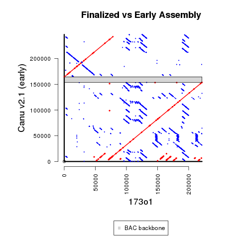

## Main Revision Overview

If a change was not validated with 2 other technologies (and we cannot otherwise explain the discrepancy), then we make provide that information in this repository.  However, we do not change the current assembly sequence.

For 173o1, there were 3 changes made on the basis of being different in an unpublished Sanger assembly as well as the **re-arranged** [public 173o1 sequence](https://www.ncbi.nlm.nih.gov/nuccore/AC275299.1):

 - T --> TC at position 31505 in 2nd Arrow-polished sequence
 - C --> CG at position 45669 in 2nd Arrow-polished sequence
 - C --> CG at position 124293 in 2nd Arrow-polished sequence
 
The third of these changes (C --> CG at position 124293in 2nd Arrow-polished sequence) was also recommended from Illumina Pilon polishing (for that earlier version of the assembly).  There are no recommended Pilon changes in the current version of 173o1.



## Methods Details

**1)** Run initial Canu assembly using `run_Canu.sh`

Create separate FASTA file for longest contig for downstream steps(provided as **173o1_10k_canu_contig_unpolished.fa**).

**2)** Run 1st round of Arrow polishing on unmodified assembly using `run_Arrow-1st.sh`

This produces the sequence **arrow_var-1st.fasta**.

**3)** Run BLAST to determine coordinates to identify location of BAC backbone.

```
makeblastdb -in $CANU -dbtype nucl
blastn -perc_identity 85 -evalue 1e-20 -query CHORI_EcoRI_BAC.fa -db $CANU -out $BLAST_TABLE -outfmt \"6 qseqid qlen qstart qend sseqid slen sstart send length pident nident mismatch gaps evalue\"
```

In the 1st Arrow-polished assembly, the BAC backbone is at coordinates 153,744-164,428.

There is a 14,850 bp sequence that is 100% identical and duplicated next to the BAC backbone.  So, only 1 copy (from "portion1") is used in the sequence re-arranged to remove the BAC backbone and end exactly at the restriction enzyme sites.

Along with consideration including the two 6 bp EcoRI sites, this is how the coordinates for the next step were determined.

**4)** Extract duplicated content from original ends of assembly using `extract_seq-simplified.py`

**5)** Combine separate extracted sequences to create a new starting sequence using `combine_seqs.py`.

This produces the sequence **173o1_rearranged.fa**.

**6)** Create sequence used for deposit and downstream analysis using `run_Arrow-2nd.sh`

This produces the sequence **arrow_var-2nd.fasta**.

**7)** Compare to Sanger and Re-Arranged public sequences.

We don't have the raw Sanger data, but the Sanger assembly is provided as **173o1_unpublished_Sanger_assembly.fa**.

We don't emphasize this in the paper because we think the (AAGGG)n repeat lengths are too long.  Nevertheless, this helps explain why we didn't make additional changes to match the public sequence, and we thought the unpublished Sanger assembly was useful to determine 3 positions that were modified in the assembly.

The methodology for the Sanger comparison matches the re-arranged public assembly alone.  For this **earlier version of the sequence**, there we provide the **173o1_Sanger-plus-J_AA173O01.pileup.xlsx** file to illustrate the justification for these changes.

**8)** Make 3 additional changes using `convert_seq.py`.  This creates the sequence used for deposit and downstream analysis.

**9)** Create supplemental coverage plot using `run_pileup.sh` and `pileup_coverage.R`.

## Optional Steps to Reproduce Figure

Run `run_MUMmer.sh` and `R_MUMmer_Plot-1_BAC_backbone.R`.

BAC backbone positions were determined using the following code (with [BLAST verison 2.6.0+](https://ftp.ncbi.nlm.nih.gov/blast/executables/blast+/2.6.0/)):

```
makeblastdb -in $EARLY_REF -dbtype nucl
blastn -evalue 1e-20 -query CHORI_EcoRI_BAC.fa -db $EARLY_REF -out $OUT -outfmt \"6 qseqid qlen qstart qend sseqid slen sstart send length pident nident mismatch gaps evalue\"
```
