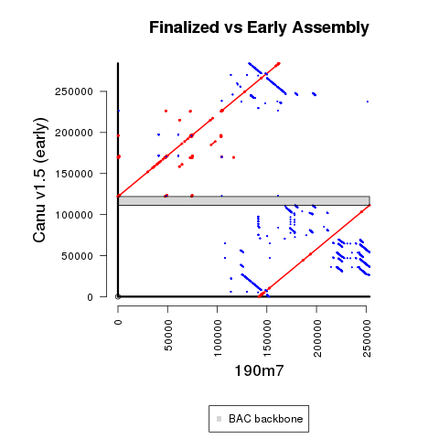
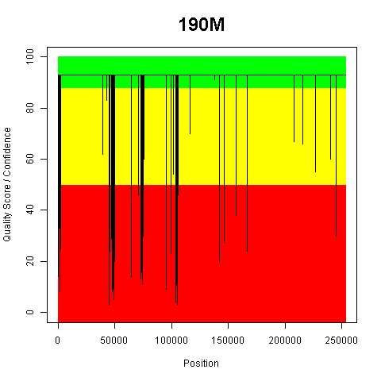

## Main Revision Overview

For 190m7, the Canu v1.5 assembly happened to have MHC-Y sequence (rather than NOR sequence) at the ends, so that is what we used to create a re-arranged assembly for 190m7.



The clones with NOR sequence tend to have some lower quality drops in that region (even with the considerable additional efforts).  So, a bed file of some of the least confident regions is provided as `190m7_Arrow-LowConfidence.bed`, and that is visually shown below:



## Methods Details

**1)** Run initial Canu assembly using `run_Canu.sh`

Create separate FASTA file for longest contig for downstream steps(provided as **190m7_10k_canu_contig_unpolished.fa**).

**2)** Run 1st round of Arrow polishing on unmodified assembly using `run_Arrow-1st.sh`

This produces the sequence **arrow_var-1st.fasta**.

**3)** Run BLAST to determine coordinates to identify location of BAC backbone.

```
makeblastdb -in $CANU -dbtype nucl
blastn -perc_identity 85 -evalue 1e-20 -query CHORI_EcoRI_BAC.fa -db $CANU -out $BLAST_TABLE -outfmt \"6 qseqid qlen qstart qend sseqid slen sstart send length pident nident mismatch gaps evalue\"
```

In the 1st Arrow-polished assembly, the BAC backbone is at coordinates 111,290-121,974.

There is a 8,514 bp sequence that is 100% identical and duplicated next to the BAC backbone.  So, only 1 copy (from "portion1") is used in the sequence re-arranged to remove the BAC backbone and end exactly at the restriction enzyme sites.

Importantly, please note that sequence ***before*** the overlap at the beginning of the assembly (*an extra 10,383 bp*) is also excluded as likely assembly error that is not as consisent with the other portion of the assembly.  Likewise, anything ***after*** the overlap was also excluded at the other end of the assembly (hence, 274,462 is used at the stop coordinate in a 284,256 bp assembly).

Along with consideration including the two 6 bp EcoRI sites, this is how the coordinates for the next step were determined.

**4)** Extract duplicated content from original ends of assembly using `extract_seq-simplified.py`

**5)** Combine separate extracted sequences to create a new starting sequence using `combine_seqs.py`.

This produces the sequence **190m7_rearranged.fa**.

**6)** Create sequence used for deposit and downstream analysis using `run_Arrow-2nd.sh`

**7)** Create separate numeric quality file using `quality_score_plot-with_table.R`, and then list of low confidence regions using `create_Arrow-LowConfidence_bed.py`.

This produces the provided **190m7_Arrow-LowConfidence.bed** file.

**8)** Create supplemental coverage plot using `run_pileup.sh` and `pileup_coverage.R`.

#Optional Steps to Reproduce Figure

Run `run_MUMmer.sh` and `R_MUMmer_Plot-1_BAC_backbone.R`.

BAC backbone positions were determined using the following code (with [BLAST verison 2.6.0+](https://ftp.ncbi.nlm.nih.gov/blast/executables/blast+/2.6.0/)):

```
makeblastdb -in $EARLY_REF -dbtype nucl
blastn -evalue 1e-20 -query CHORI_EcoRI_BAC.fa -db $EARLY_REF -out $OUT -outfmt \"6 qseqid qlen qstart qend sseqid slen sstart send length pident nident mismatch gaps evalue\"
```