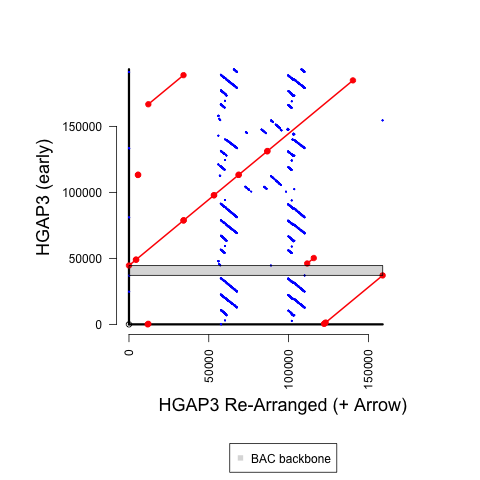

## Main Revision Overview

There were some important troubleshooting steps for this assembly, although we didn't want to add confusion in terms of describing how to reproduce the exact sequence that was used in the publication.

So, there is a **side note** at the bottom to give some additional background.

However, we hope that the code and details steps help explain how you can start with an HGAP3 assembly and generate a reliable circular sequence that we considered appropriate to use in a publication.

In some ways, this might be more helpful for others hoping to revise such sequence with hopefully fewer iterations (and possibly avoid the need to transfer the annotations between assemblies with sometimes noticable sequence changes).



## Methods Details

**1)** Download HGAP3 assembly from SMRT Portal

This is the sequence **19d16_016471_revcom.fa**.

**2)** Find BAC backbone in HGAP3 sequence using `find_motifs-TAMU_EcoRI_BAC.py`.

In the starting HGAP3 sequence, the BAC bacbone is found at position *37062-44574*.

**3)** Separate Sequence Before and After BAC Backbone using `extract_seq-extra_12bp-for_GitHub.py`

**4)** BLAST portions to identify sequence to trim and overlap, using `BLAST_separate_seqs.py` followed by `extract_seq-extra_12bp-for_GitHub.py`.

**4)** Combine non-overlapping sequence to define linear representation of circular sequence that ends at the EcoRI restriction enzyme sites using `combine_seqs.py`.

This produces the sequence **HGAP3_19d16-rearranged.fa**.

**5)** Create sequence used for deposit and downstream analysis using `run_Arrow.sh`

**6)** Create supplemental coverage plot using `run_pileup.sh` and `pileup_coverage.R`.

#Optional Steps to Reproduce Figure

Run `run_MUMmer.sh` and `R_MUMmer_Plot-1_BAC_backbone.R`.

BAC backbone positions were determined using the following code (with [BLAST verison 2.6.0+](https://ftp.ncbi.nlm.nih.gov/blast/executables/blast+/2.6.0/)):

```
makeblastdb -in $EARLY_REF -dbtype nucl
blastn -evalue 1e-20 -query TAMU_EcoRI_BAC.fa -db $EARLY_REF -out $OUT -outfmt \"6 qseqid qlen qstart qend sseqid slen sstart send length pident nident mismatch gaps evalue\"
```

### Side Note

There are also some additional details on *slide #4* of [this (less formal) summary](https://github.com/marbl/canu/files/5532554/Summary.-.Round56k.pdf) from [this discussion](https://github.com/marbl/canu/issues/1841).

However, that varies from what is described above for a couple reasons:

**1)** That screenshot shows an unpolished re-arranged sequence.

**2)** In order to report a sequence whose generation was 100% reproducible, we created an alternative 19d16.  There is only a repeat copy number variation of 5 bp in the ***polished*** version, but there were additional small differences in the unpolished version (*after correcting for a medium-to-large duplication error when attempting to define a circular sequence*).

Nevertheless, those slides are helpful in terms of understanding the additional troubleshooting needed to correct large differences in the assembly for some contigs, noticable additional work was still carried out afterwards.

In terms of the important conceptual step to identify the medium-to-large duplication, having *Canu* assemblies was helpful to first identify a potential problem.  However, the above code shows the exact steps to go from the original HGAP3 sequence to what we have decided to use.
