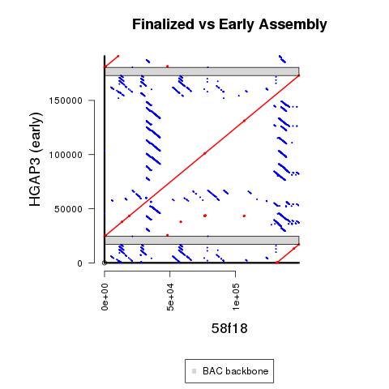

## Main Revision Overview



There are also some additional details on *slide #4* of [this (less formal) summary](https://github.com/marbl/canu/files/5532554/Summary.-.Round56k.pdf) from [this discussion](https://github.com/marbl/canu/issues/1841).  However, that screenshot shows the unpolished re-arranged sequence (even though that is already an improvement over the previous reference sequence).

We continued to use sequence from the HGAP3 assembly, but we needed to trim an additional substantial portion from the beginning of the manually re-arranged sequence.
## Methods Details

**1)** Download HGAP3 assembly from SMRT Portal

This is the sequence **58f18_016469.fa**.

**2)** Use manually re-arranged sequence to create revised sequence (to remove sharp dip in coverage).  This also includes some minor changes to better match earlier version of 173o1?

This is the sequence **58f18_earlier.fa**.

Additional changes needed to be made afterwards.  However, I believe the goal was to extract 2 copies of the BAC backbone, although the 3 segments were concatinated in a different order, instead of being trimmed.  Also, the exact start and stop was a little different.

You can find 100% identical mappings between the 2 sequences as follows:

<table>
  <tbody>
    <tr>
      <th align="center"></th>
      <th align="center">HGAP3</br>(original)</th>
	  <th align="center">HGAP3</br>(re-arranged)</th>
    </tr>
    <tr>
      <td align="center">segment2</td>
	  <td align="center">1-17,740</td>
	  <td align="center">10,444-28,183</td>
    </tr>
    <tr>
      <td align="center">segment3/td>
	  <td align="center">24,399-172,976</td>
	  <td align="center">28,183-176,760</td>
    </tr>
    <tr>
      <td align="center">segment1</td>
	  <td align="center">180,478-190,920</td>
	  <td align="center">1-10,443</td>
    </tr>
</tbody>
</table>

For example, only sequence from the largest **segment3** is used later on, as shown in detail in the later code.

**3)** Run BLAST to identify the positions of the 2 BAC backbones:

```
makeblastdb -in $HGAP3 -dbtype nucl
blastn -penalty -2 -ungapped -perc_identity 95 -evalue 1e-20 -query $BAC -db $HGAP3 -out $BLAST_TABLE -outfmt \"6 qseqid qlen qstart qend sseqid slen sstart send length pident nident mismatch gaps evalue\"
```

**4)** Extract sequence between the 2 BAC backbones using `extract_seq.py`

This produces the sequence **58f18_trimmed.fa**.

**5)** Create sequence used for deposit and downstream analysis using `run_Arrow.sh`

**6)** Create supplemental coverage plot using `run_pileup.sh` and `pileup_coverage.R`.

#Optional Steps to Reproduce Figure

Run `run_MUMmer.sh` and `R_MUMmer_Plot-2_BAC_backbone.R`.

BAC backbone positions were determined using the following code (with [BLAST verison 2.6.0+](https://ftp.ncbi.nlm.nih.gov/blast/executables/blast+/2.6.0/)):

```
makeblastdb -in $EARLY_REF -dbtype nucl
blastn -evalue 1e-20 -query TAMU_EcoRI_BAC.fa -db $EARLY_REF -out $OUT -outfmt \"6 qseqid qlen qstart qend sseqid slen sstart send length pident nident mismatch gaps evalue\"
```