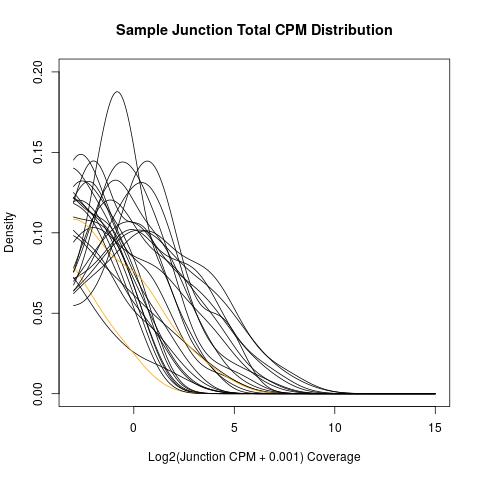

## Scripts to Asssess Annotations

**1)** Run `STAR-STEP01-create_splice_junction_table-STAR-v3b.py`

 - This creates various types of files for each separate contig (unique junction counts, multi-mapped junction counts, etc.)
 - Also, separately for each contig, normalized CPM is calculated.  **However, please note that this is not adjusted for copy number until a later step.**

This also creates the file *STAR_read_stats-param9.txt*, provided on this GitHub page.

**2a)** Run `STAR-STEP02a-create_splice_junction_table_COMBINED-STAR-v3d.R` to create combined files and some QC plots.

This creates the following tables of coverage each splice junction in **each of the 27 [Chickspress](https://geneatlas.arl.arizona.edu/) samples**.  Additional sample label information comes from the uploaded files **PRJNA204941.txt** (uploaded in this folder).

**Raw Counts**: *combined_splice_junctions-STAR-v3_RAW-param9.txt*

**Unique Counts (Count-Per-Million, CPM)**: *combined_splice_junctions-STAR-v3_uniqueCPM-param9.txt*

**2b)** Run `STAR-STEP02b-adjust_totalCPM_for_copy_number.R` to adjust total CPM values based upon the total gene copies across the 4 contigs.

This creates the file *combined_splice_junctions-STAR-v4_totalCPM-param9-ADJUSTED.txt*, with **per-sample** mean Count-Per-Million (CPM) **adjusted** by the number of known copy-number on Contigs 1-4.

Unique counts don't need to be adjusted by copy number, so this only adjusted the multi-mapped counts (when they contribute to the total counts).

Please note that this function may perform differently in different version of R, in addition to not providing every single file that was created across several years.

For example, the script above works with **R v4.1.2** on Windows, but it encountered a problem when running R *v3.4.4* within Ubuntu.

**2c)** Run `STAR-STEP02c-create_splice_junction_table_COMBINED-STAR-v3e.R` to create combined files (importantly, the total CPM counts will now be adjusted for known copies).

This creates the file with mean Count-Per-Million (CPM) values for each junction, along with the following density distributions for the mean CPM per splice junction.

**3)** Create some additional separate files with varying stringency using `STAR-STEP03-create_splice_junction_list-STAR-v3b.py`.

**4)** Create a summary of junctions in 1 file using `STAR-STEP04-create_splice_junction_summary-STAR-v3c.R`.

This creates the file *combined_splice_junctions-STAR-v4-param9-ADJUSTED_CPM.txt*.

**5)** Define confidence assignments using  `STAR-STEP05-create_splice_junction_table_CATEGORY-STAR-v5.R`.

**Evidence Categories (Per Locus)**: *combined_splice_junctions-STAR-v4-CATEGORIES-param9-ADJUSTED_CPM-PER_LOCUS.txt*

Presentation of Evidence Categories in the paper summarizes expression across 100% copies.  However, the exact values are a little different and can be viewed in the file above (in this repository).

## Potential Additional Considerations

**a)** Quantify evenness of coverage and generate QC plots for all gene candidates with multiple exons using  `STAR_SD_calculations_and_plots-v3.R`.

The QC plots for evenness of coverage can be found within the [SD_Plots](https://github.com/cwarden45/Miller_Red_Jungle_Fowl_MHCY/tree/main/Part2_Annotation/STAR_Splice_Junction_Evidence/SD_Plots) subfolder.

Summary statistics at various thresholds can be found within the **SD_stats.txt** file.

Statistics for individual transcripts / samples that qualified to be tested with a median adjusted CPM greater than 10 (before the log2-transformation for the standard deviation calculation) are described below (for a representative locus, if there are multiple 100% identical gene copies):

<table>
  <tbody>
    <tr>
      <th align="center">Gene</th>
      <th align="center">Sample</th>
	  <th align="center">Splice Junction Standard Deviation</th>
    </tr>
    <tr>
	  <td align="center"><b>MHCY8a</b> (Good Evidence)</td>
      <td align="center">SRR924564.M.sciatic.nerve</td>
     <td align="center"><b>0.15</b> <i>(low SD = even expr)</i></td>
    </tr>
    <tr>
	  <td align="center"><b>MHCY37c</b> (Good Evidence)</td>
      <td align="center">SRR924567.F.sciatic.nerve</td>
     <td align="center"><b>0.22</b> <i>(low SD = even expr)</i></td>
    </tr>
    <tr>
	  <td align="center"><b>MHCY37c</b> (Good Evidence)</td>
      <td align="center">SRR924202.M.adrenal_gland</td>
     <td align="center"><b>0.36</b> <i>(low SD = even expr)</i></td>
    </tr>
    <tr>
	  <td align="center"><b>MHCY37c</b> (Good Evidence)</td>
      <td align="center">SRR924564.M.sciatic.nerve</td>
     <td align="center"><b>0.42</b> <i>(low SD = even expr)</i></td>
    </tr>
    <tr>
	  <td align="center"><b>MHCY37c</b> (Good Evidence)</td>
      <td align="center">SRR924550.F.heart</td>
     <td align="center"><b>0.55</b> <i>(low SD = even expr)</i></td>
    </tr>
    <tr>
	  <td align="center"><b>MHCY37c</b> (Good Evidence)</td>
      <td align="center">SRR924554.F.kidney</td>
     <td align="center"><b>0.57</b> <i>(low SD = even expr)</i></td>
    </tr>
    <tr>
	  <td align="center"><b>MHCY37c</b> (Good Evidence)</td>
      <td align="center">SRR924555.M.liver</td>
     <td align="center"><b>0.58</b> <i>(low SD = even expr)</i></td>
    </tr>
    <tr>
	  <td align="center"><b>MHCY37c</b> (Good Evidence)</td>
      <td align="center">SRR924556.F.liver</td>
     <td align="center">0.90</td>
    </tr>
    <tr>
	  <td align="center"><b>MHCY37c</b> (Good Evidence)</td>
      <td align="center">SRR924585.F.spleen</td>
     <td align="center">1.22</td>
    </tr>
    <tr>
	  <td align="center"><b>MHCY37c</b> (Good Evidence)</td>
      <td align="center">SRR924539.F.adipose</td>
     <td align="center">1.27</td>
    </tr>
    <tr>
	  <td align="center"><b>MHCY37c</b> (Good Evidence)</td>
      <td align="center">SRR924582.M.spleen</td>
     <td align="center">1.29</td>
    </tr>
    <tr>
	  <td align="center"><b>MHCY37c</b> (Good Evidence)</td>
      <td align="center">SRR924485.M.adipose</td>
     <td align="center">1.36</td>
    </tr>
    <tr>
	  <td align="center"><b>MHCY37c</b> (Good Evidence)</td>
      <td align="center">SRR924558.F.lung</td>
     <td align="center">1.77</td>
    </tr>
    <tr>
	  <td align="center"><b>MHCY37c</b> (Good Evidence)</td>
      <td align="center">SRR924557.M.lung</td>
     <td align="center">1.85</td>
    </tr>
    <tr>
	  <td align="center">MHCY5f</td>
      <td align="center">SRR924567.F.sciatic.nerve</td>
     <td align="center">1.60</td>
    </tr>
    <tr>
	  <td align="center">MHCY5f</td>
      <td align="center">SRR924564.M.sciatic.nerve</td>
     <td align="center">1.81</td>
    </tr>
    <tr>
	  <td align="center">MHCY5f</td>
      <td align="center">SRR924554.F.kidney</td>
     <td align="center">1.88</td>
    </tr>
    <tr>
	  <td align="center">MHCY5f</td>
      <td align="center">SRR924550.F.heart</td>
     <td align="center">2.03</td>
    </tr>
    <tr>
	  <td align="center">MHCY5f</td>
      <td align="center">SRR924539.F.adipose</td>
     <td align="center">2.49</td>
    </tr>
    <tr>
	  <td align="center">MHCY5f</td>
      <td align="center">SRR924585.F.spleen</td>
     <td align="center">2.59</td>
    </tr>
    <tr>
	  <td align="center">MHCY5f</td>
      <td align="center">SRR924557.M.lung</td>
     <td align="center">2.71</td>
    </tr>
    <tr>
	  <td align="center">MHCY5f</td>
      <td align="center">SRR924582.M.spleen</td>
     <td align="center">2.72</td>
    </tr>
    <tr>
	  <td align="center">MHCY5f</td>
      <td align="center">SRR924558.F.lung</td>
     <td align="center">3.00</td>
    </tr>
    <tr>
	  <td align="center">MHCY32g</td>
      <td align="center">SRR924567.F.sciatic.nerve</td>
     <td align="center">1.62</td>
    </tr>
    <tr>
	  <td align="center">MHCY32g</td>
      <td align="center">SRR924564.M.sciatic.nerve</td>
     <td align="center">1.82</td>
    </tr>
    <tr>
	  <td align="center">MHCY32g</td>
      <td align="center">SRR924554.F.kidney</td>
     <td align="center">1.88</td>
    </tr>
    <tr>
	  <td align="center">MHCY32g</td>
      <td align="center">SRR924539.F.adipose</td>
     <td align="center">2.50</td>
    </tr>
    <tr>
	  <td align="center">MHCY32g</td>
      <td align="center">SRR924585.F.spleen</td>
     <td align="center">2.57</td>
    </tr>
    <tr>
	  <td align="center">MHCY32g</td>
      <td align="center">SRR924557.M.lung</td>
     <td align="center">2.72</td>
    </tr>
    <tr>
	  <td align="center">MHCY32g</td>
      <td align="center">SRR924582.M.spleen</td>
     <td align="center">2.72</td>
    </tr>
    <tr>
	  <td align="center">MHCY32g</td>
      <td align="center">SRR924558.F.lung</td>
     <td align="center">3.01</td>
    </tr>
    <tr>
	  <td align="center">MHCY39r <i>(fewer exons)</i></td>
      <td align="center">SRR924558.F.lung</td>
     <td align="center">3.77</td>
    </tr>
    <tr>
	  <td align="center">YLEC8a</td>
      <td align="center">SRR924582.M.spleen</td>
     <td align="center">2.02</td>
    </tr>
    <tr>
	  <td align="center">YLEC8a</td>
      <td align="center">SRR924585.F.spleen</td>
     <td align="center">2.04</td>
    </tr>
    <tr>
	  <td align="center">YLEC9b</td>
      <td align="center">SRR924582.M.spleen</td>
     <td align="center">2.17</td>
    </tr>
</tbody>
</table>

Selected samples to walk through the visualization are provided [here]().  **The basic idea is that genes with high expression but a *low standard deviation* calculated across splice junctions for a given sample will be more likely to have an even contribution of reads that may truely come from the intended locus.**  For example, when the coverage spikes within a subset of the gene, then we believe this indicates evidence that those reads contributing to the substantially higher coverage are **not** in fact coming from the locus of interest.

So, **bold font** is used in the table above, when expression is relatively *even* (with a **standard deviation less than 0.6**).  Please notice that this corroborates identification of **MHCY-a** and **MHCY-c** as "Good" evidence annotations, whereas the other genes have high adjusted CPM values that might be misleadingly high (and the uneven expression matches the conclusion that these should *not* identified as "Good" evidence annotations, which was originally based due to the lack of high coverage evidence for at least one splice junction within the gene model across all samples)

**b)** [STAR parameter troubleshooting](https://github.com/cwarden45/Miller_Red_Jungle_Fowl_MHCY/discussions/2)
