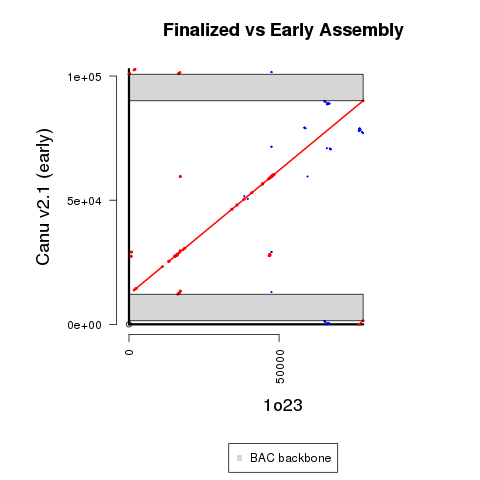
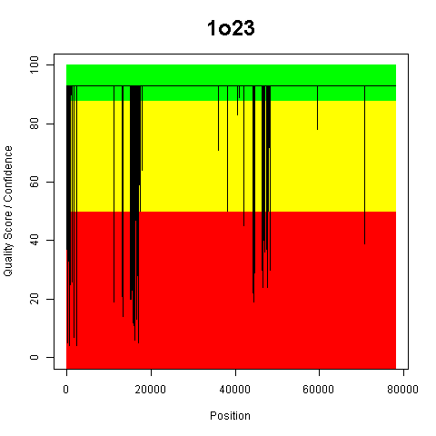

## Main Revision Overview

For 1o23, the Canu v2.1 assembly included 2 BAC backbones, so we used that to more confidently include the sequence between the BAC backbones (keeping the 6 bp EcoRI site within the BAC backbone):



The clones with NOR sequence tend to have some lower quality drops in that region (even with the considerable additional efforts).  So, a bed file of some of the least confident regions is provided as `1o23_Arrow-LowConfidence.bed`, and that is visually shown below:




## Methods Details

**1)** Run initial Canu assembly using `run_Canu.sh`

Create separate FASTA file for longest contig for downstream steps (provided as **1o23_10k_canu_contig_unpolished.fa**).

**2)** Run 1st round of Arrow polishing on unmodified assembly using `run_Arrow-1st.sh`

This produces the sequence **arrow_var-1st.fasta**.

**3)** Create sequence between BAC backbones but containing EcoRI site using `extract_seq.py`

This produces the sequence **Canu-v2.1-Arrow_1o23-trimmed_extra-12-bp_expectedBAC.fa**.

**4)** Create sequence used for deposit and downstream analysis using `run_Arrow-2nd.sh`

**5)** Create separate numeric quality file using `quality_score_plot-with_table.R`, and then list of low confidence regions using `create_Arrow-LowConfidence_bed.py`.

This produces the provided **1o23_Arrow-LowConfidence.bed** file.

**6)** Create supplemental coverage plot using `run_pileup.sh` and `pileup_coverage.R`.

#Optional Steps to Reproduce Figure

Run `run_MUMmer.sh` and `R_MUMmer_Plot-2_BAC_backbone.R`.

BAC backbone positions were determined using the following code (with [BLAST verison 2.6.0+](https://ftp.ncbi.nlm.nih.gov/blast/executables/blast+/2.6.0/)):

```
makeblastdb -in $EARLY_REF -dbtype nucl
blastn -evalue 1e-20 -query CHORI_EcoRI_BAC.fa -db $EARLY_REF -out $OUT -outfmt \"6 qseqid qlen qstart qend sseqid slen sstart send length pident nident mismatch gaps evalue\"
```