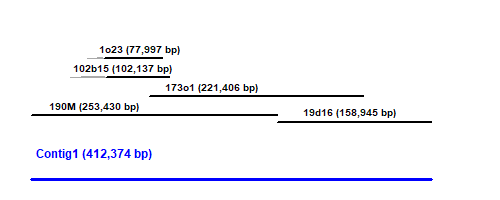

First, 190M and 19d16 sequence were combined (omitting the overlapping EcoRI site) to create a draft Contig1.

Then, each separate assembly (re-arranged/trimmed as needed, and with an additional round of polishing) was aligned to the Contig1 draft using [BWA-MEM version 0.7.15-r1140](https://sourceforge.net/projects/bio-bwa/files/), with the “-M” parameter).  There were split reads that had poor alignments with the reference (all in the NOR region).  So, those were manually filtered to pick the alignments that represented the sequences similar to what is captured with [blastn version 2.2.27+](https://ftp.ncbi.nlm.nih.gov/blast/executables/blast+/2.2.27/) with parameters “-perc_identity 95 -evalue 1e-20”) hit segments.  Variations from the reference (such as in the majority of reads or those matching a subset of 190M suggested CCS/Illumina polishing changes) were found by creating  a .pileup file [samtools version 1.4](https://github.com/samtools/samtools/releases/tag/1.4) on the manually filtered alignment, with default parameters). 

The following 7 changes were made due the majority of clones having a different sequence than 190M:
 - C to CG at previous position 95439
 - GC to G at previous position 101375
 - AC to A at previous position 103583
 - A to AT at previous position 103685
 - A to AC at previous position 103997
 - A to AC at previous position 104654
 - T to TC at previous position 104976.
 
 It wasn’t possible to define a majority in the region that overlaps 19d16 and 173o1.
 
 However, for the 190M CCS and Illumina polishing calls, the 173o1 sequence would be checked when there was no overlapping 102b15 or 1o23 sequence.  Using the uncertain polishing calls as a tie breaker, the extra 2 changes were made to produce the Contig1 sequence: 
 
  - C to CA at previous position 146229
  - C to CG at previous position 166681

After making those 9 small changes, the separate assemblies were re-aligned.

As noted in [this discussion](https://github.com/marbl/canu/issues/1841), we believe that there were some extra changes after BAC creation for the NOR sequences, in addition to a having a greater fraction of low confidence regions from Arrow polishing.

**There was also a minor change in the length of a repeat after changing 19d16.**  So, instead of starting from the beginning with a new merged 190M + 19d16 sequence, we used the following scripts to confirm the **5 bp addition** and illustrate the code used for the revision process:

**1)** Align the 5 separate contig sequences to the previous (or starting) Contig 1 sequence using `BWA-MEM_alignment.py`.

**2)** Manually remove problematic supplemental alignments in the .sam file and continue processing the alignment using `BWA-MEM_alignment-downstream.py`.

This doesn't have to be manual given that the reads being removed have a different flag value.  However, I initially inspected each alignment, and the reads that were manually removed ended up being all of the supplemental alignments (in this situation).

**3)** Look for regions to change (originally, from 190M and 19d16) using `review_pileup.R`.

In this most recent example, there was not a change identified in the **status** column.  However, that is because there are not 3 sequences, and *you would usually need 2 out of 3 other sequences to justify a change from the original 190M or 19d16 sequence* (the exception here being that we changed the 19d16 sequence after making revisions with the earlier version).

If you check position **339990**, then you can see that 173o1 and 19d16 now agree (and both indicate that the repeat should be expanded be 1 copy (**+5AAGGG**)

**4)** Assuming a change needs to be made for the consensus, you can make the change using the `convert_seq.py` script.

In order to confirm that I have defined the chagne correctly, I would also run `check_seq.py` to double-check that I am adding or removing the intended sequence (providing a visualization for the flanking sequence around the change).

For example, in *confirm-10CHANGE-339990.txt*, you can see that the change is being made at the beginning of the (AAGGG)n repeat sequence.

**5)** Once you have all of the final (or most recent) sequences, you can compare the clones to the Contig 1 sequence again using `BLAST_BACs.py` (with [BLAST verison 2.6.0+](https://ftp.ncbi.nlm.nih.gov/blast/executables/blast+/2.6.0/)).  The "ALT" hits help identify the 100% matches for the contig boundaries, but it can miss some of the more divergent sequence hits (such as in the NOR region).

That information can be used to manually define boundaries within the R script `assembly_line_plot.R` to create a summary plot:

