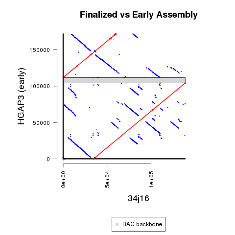

## Main Revision Overview



## Methods Details

**1)** Download HGAP3 assembly from SMRT Portal

This is the sequence **34j16_016566.fasta**.

**2)** Use manually re-arranged sequence to create polished sequence in the next.  This manual re-arrangement removed the BAC backbone as well as trimming duplicated sequence at the ends of the original assembly.

This is the sequence **Contig3_rev-earlier.fa**.

You can find 100% identical mappings between the 2 sequences as follows:

<table>
  <tbody>
    <tr>
      <th align="center"></th>
      <th align="center">HGAP3</br>(original)</th>
	  <th align="center">HGAP3</br>(re-arranged)</th>
    </tr>
    <tr>
      <td align="center">segment1</td>
	  <td align="center">111,809-146,410</td>
	  <td align="center">1-34,602</td>
    </tr>
    <tr>
      <td align="center">segment2/td>
	  <td align="center">1-104,307</td>
	  <td align="center">34,603-138,909</td>
    </tr>
</tbody>
</table>

**3)** Create sequence used for deposit and downstream analysis using `run_Arrow.sh`

**4)** Create supplemental coverage plot using `run_pileup.sh` and `pileup_coverage.R`.

#Optional Steps to Reproduce Figure

Run `run_MUMmer.sh` and `R_MUMmer_Plot-1_BAC_backbone.R`.

BAC backbone positions were determined using the following code (with [BLAST verison 2.6.0+](https://ftp.ncbi.nlm.nih.gov/blast/executables/blast+/2.6.0/)):

```
makeblastdb -in $EARLY_REF -dbtype nucl
blastn -evalue 1e-20 -query TAMU_HindIII_BAC.fa -db $EARLY_REF -out $OUT -outfmt \"6 qseqid qlen qstart qend sseqid slen sstart send length pident nident mismatch gaps evalue\"
```